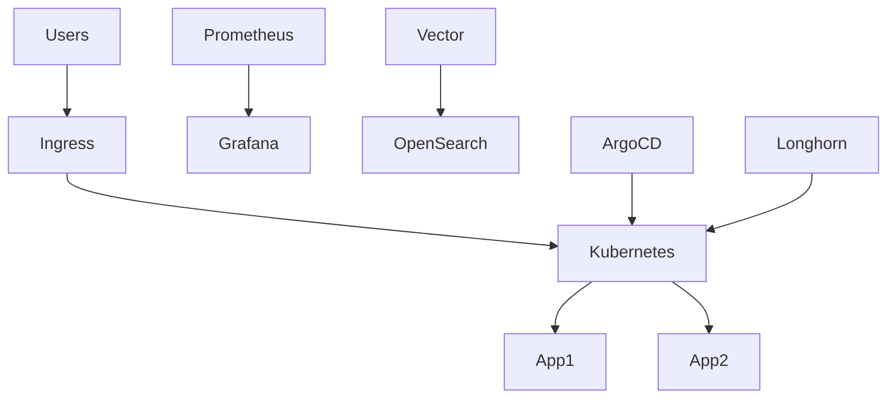

# Архитектура платформы

## Описание узлов: 
- cp-1      control-plane + etcd
- cp-2      control-plane + etcd
- cp-3      control-plane + etcd
- worker-1  application
- worker-2  application
- worker-3  infra

 ## Компоненты платформы: 
    ### Kubernetes
    - Kubespray
    - Kubernetes
    - Containerd
    - Calico

    ### Мониторинг
    - Prometeus 
    - Grafana
    - Alertmanaget

    ### Логирование
    - Vector
    - OpenSearch

    ### GitOps
    - ArgoCD

    ### CI/CD 
    - GitLab CI

    ### Storage 
    - Longhorn

