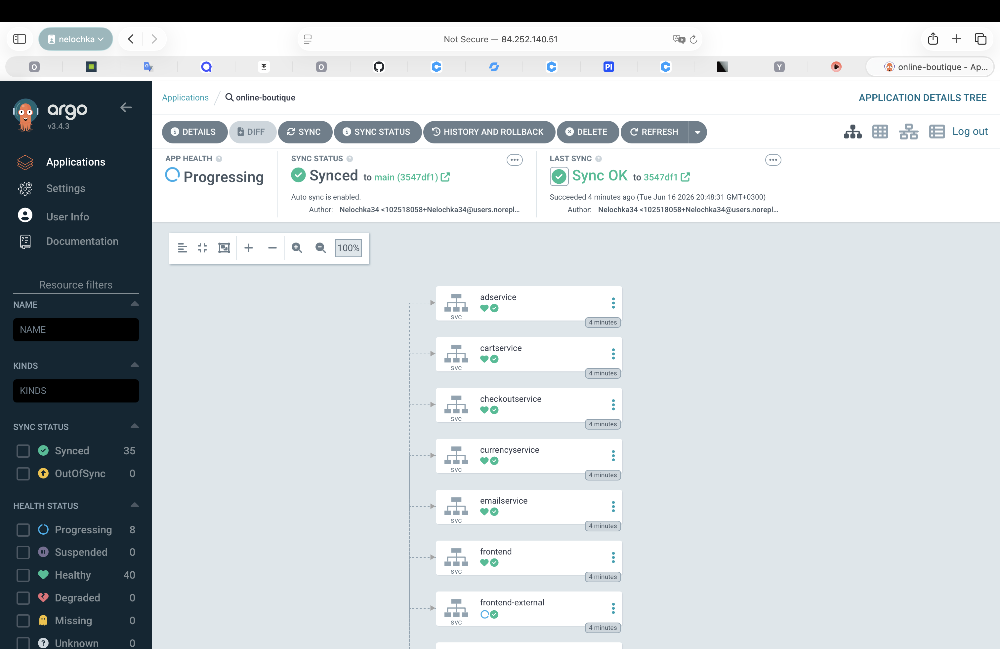
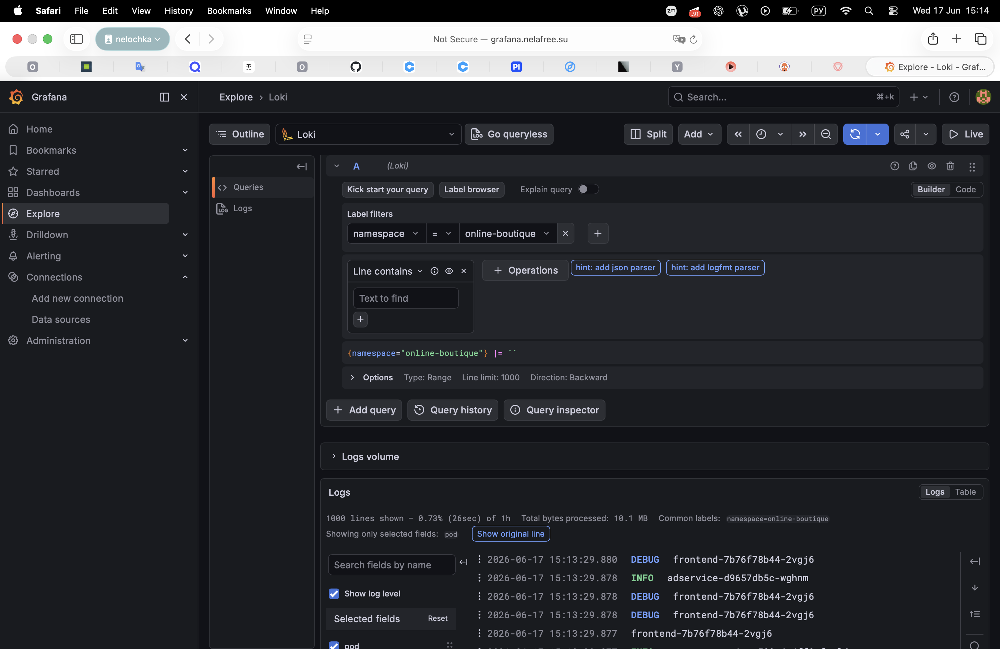
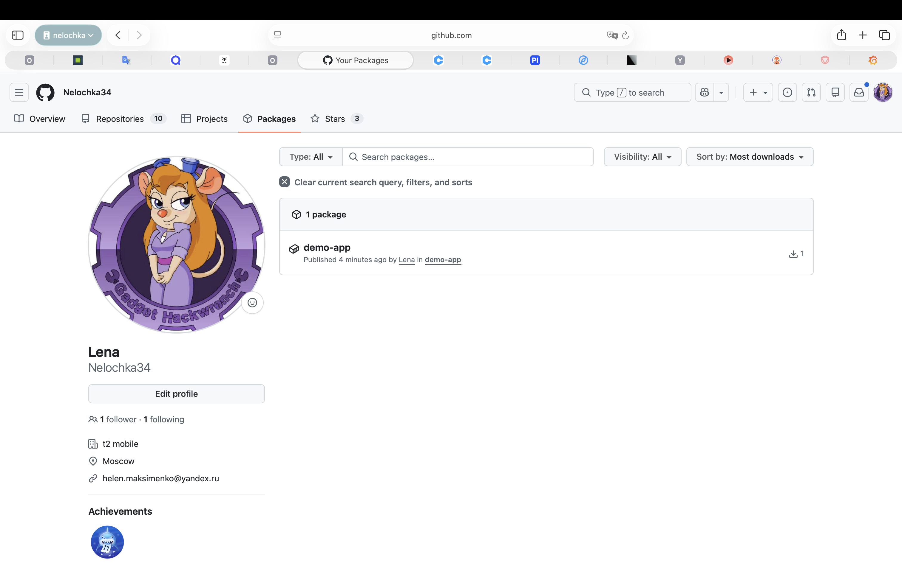
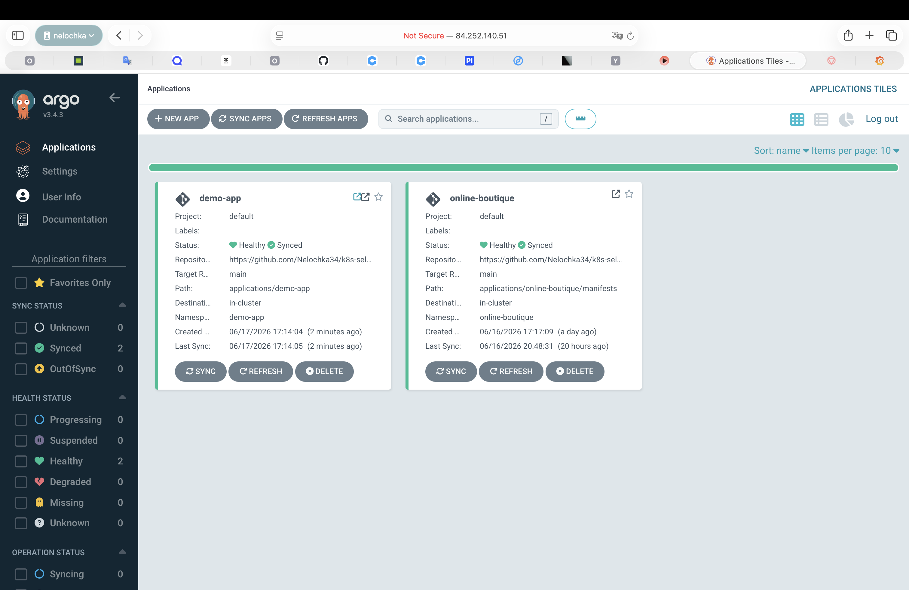
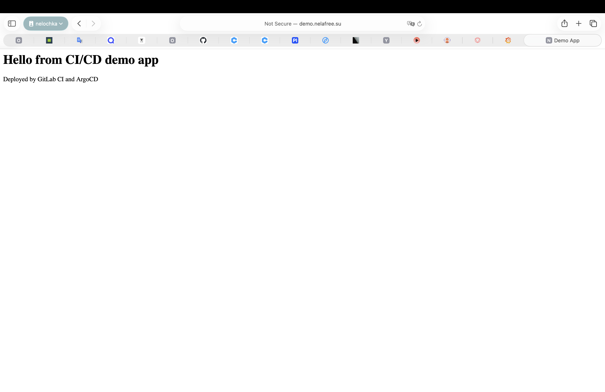

# Дневник проекта

### Шаг 1. Подготовка репозитория

- создан публичный репозиторий https://github.com/Nelochka34/k8s-self-managed-platform
- создана структура каталогов
- добавлены readme.md, .gitignore

### Шаг 2. Развертывание инфраструктуры

- создан документ [Архитектура платформы](docs/architecture.md)
- создан документ [Inventory](infrastructure/inventory.md)

Созданы ВМ: 
```bash
yc compute instance list
+----------------------+----------+---------------+---------+----------------+-------------+
|          ID          |   NAME   |    ZONE ID    | STATUS  |  EXTERNAL IP   | INTERNAL IP |
+----------------------+----------+---------------+---------+----------------+-------------+
| epdaiubo5n77geq3h8pf | cp-1     | ru-central1-b | RUNNING | 84.252.140.51  | 10.129.0.21 |
| epdblrrfdudu8droddmg | worker-2 | ru-central1-b | RUNNING | 111.88.151.83  | 10.129.0.17 |
| epdcjchae4sltn8qnppv | cp-3     | ru-central1-b | RUNNING | 84.201.143.60  | 10.129.0.3  |
| epdmepbn47haur655uoo | worker-1 | ru-central1-b | RUNNING | 89.169.188.52  | 10.129.0.8  |
| epdotjuvdum847p6s188 | cp-2     | ru-central1-b | RUNNING | 89.169.178.122 | 10.129.0.26 |
+----------------------+----------+---------------+---------+----------------+-------------+
```
Подготовлен inventory-файл для HA-кластера:
- 3 control-plane узла;
- 3 etcd узла;
- 2 worker узла.

### Шаг 3. Автоматизирование создания кластера через Kubespray

Для автоматизации развертывания Kubernetes выбран Kubespray. 

Выполнена проверка подключения ко всем узлам: 
```bash
ansible -i inventory/k8s-platform/inventory.ini all -m ping
```
Все узлы доступны по ssh и готовы к развертыванию. 

Подготавливаю и настраиваю Kubespray перед установкой: 
- открыла главный конфиг: nano inventory/k8s-platform/group_vars/k8s_cluster/k8s-cluster.yml
- задала там: 
```bash
container_manager: containerd
kube_network_plugin: calico

kube_proxy_mode: iptables

kube_pods_subnet: 10.233.64.0/18
kube_service_addresses: 10.233.0.0/18
```
Файл inventory.ini был перенесён из рабочей директории Kubespray в репозиторий проекта по пути:
[`inventory.ini`](../infrastructure/kubespray/inventory.ini)

Запустила установку кластера: 
```bash
ansible-playbook \
-i inventory/k8s-platform/inventory.ini \
-b \
cluster.yml
```
 При этом на всех 5 ВМ Kubespray: проверяет ОС, проверяет память и CPU, настраивает sysctl, включает сетевой форвардинг, отключает ненужные параметры, подготавливает систему для Kubernetes, устанавливается containerd, Kubernetes, создается etcd-кластер, создается control-plane,  устанавливается calico, подключаются worker. 

 После установке подключаюсь к cp-1 и проверяю: 
 ```bash
 ssh el_maksimenko@84.252.140.51
 ```
 ```bash
kubectl get nodes

NAME       STATUS   ROLES           AGE   VERSION
cp-1       Ready    control-plane   10m   v1.36.2
cp-2       Ready    control-plane   10m   v1.36.2
cp-3       Ready    control-plane   10m   v1.36.2
worker-1   Ready    <none>          9m    v1.36.2
worker-2   Ready    <none>          9m    v1.36.2
 ```
Кластер успешно развернут. 

### Шаг 4. ingress-nginx
Для того, чтобы Kubernetes стал принимать запросы извне нужен Ingress controller. 

Я подключилась к cp-1 ноде и настраиваю через нее: 
```bash
ssh el_maksimenko@84.252.140.51
```
Буду ставить через helm: 
```bash
helm version
version.BuildInfo{Version:"v3.18.4", GitCommit:"d80839cf37d860c8aa9a0503fe463278f26cd5e2", GitTreeState:"clean", GoVersion:"go1.24.4"}
```
- добавляю репозиторий: 
```bash
helm repo add ingress-nginx https://kubernetes.github.io/ingress-nginx
helm repo update
```
- создаю namespace
```bash
kubectl create namespace ingress-nginx
```
- устанавливаю: 
```bash
helm install ingress-nginx ingress-nginx/ingress-nginx \
  --namespace ingress-nginx
```
- проверяю: 
```bash
kubectl get pods -n ingress-nginx 
NAME                                        READY   STATUS    RESTARTS   AGE
ingress-nginx-controller-5cd9869bf8-xx6xm   1/1     Running   0          22s
```
- проверяю сервис: 
```bash
kubectl get svc -n ingress-nginx
NAME                                 TYPE           CLUSTER-IP      EXTERNAL-IP   PORT(S)                      AGE
ingress-nginx-controller             LoadBalancer   10.233.45.111   <pending>     80:31832/TCP,443:31102/TCP   66s
ingress-nginx-controller-admission   ClusterIP      10.233.32.154   <none>        443/TCP                      66s
```

### Шаг 5. ArgoCD

- создаю namespace
```bash
kubectl create namespace argocd
```
- устанавливаю: 
```bash
kubectl apply -n argocd \
  -f https://raw.githubusercontent.com/argoproj/argo-cd/stable/manifests/install.yaml
```
- проверка: 
```bash
kubectl get pods -n argocd
NAME                                                READY   STATUS    RESTARTS   AGE
argocd-application-controller-0                     1/1     Running   0          40s
argocd-applicationset-controller-5bc66cf64c-jgk87   1/1     Running   0          41s
argocd-dex-server-6757c445bb-pm4pn                  1/1     Running   0          41s
argocd-notifications-controller-846d8c8b79-t88fn    1/1     Running   0          40s
argocd-redis-697fdb7798-bfvvr                       1/1     Running   0          40s
argocd-repo-server-676ccbb646-jbz9w                 0/1     Running   0          40s
argocd-server-7b8c88c5c5-h6x9q                      0/1     Running   0          40s
```
```bash
kubectl get svc -n argocd
NAME                                      TYPE        CLUSTER-IP      EXTERNAL-IP   PORT(S)                      AGE
argocd-applicationset-controller          ClusterIP   10.233.41.85    <none>        7000/TCP,8080/TCP            86s
argocd-dex-server                         ClusterIP   10.233.63.50    <none>        5556/TCP,5557/TCP,5558/TCP   86s
argocd-metrics                            ClusterIP   10.233.13.199   <none>        8082/TCP                     86s
argocd-notifications-controller-metrics   ClusterIP   10.233.16.242   <none>        9001/TCP                     86s
argocd-redis                              ClusterIP   10.233.21.141   <none>        6379/TCP                     86s
argocd-repo-server                        ClusterIP   10.233.46.163   <none>        8081/TCP,8084/TCP            86s
argocd-server                             ClusterIP   10.233.13.31    <none>        80/TCP,443/TCP               86s
argocd-server-metrics                     ClusterIP   10.233.43.78    <none>        8083/TCP                     86s
```
Чтобы открыть ArgoCD на своем компе я сделала ArgoCD доступным через NodePort: 
```bash
kubectl get svc argocd-server -n argocd
NAME            TYPE        CLUSTER-IP     EXTERNAL-IP   PORT(S)          AGE
argocd-server   ClusterIP   10.233.13.31   <none>        80/TCP,443/TCP   13m
```
```bash
kubectl patch svc argocd-server -n argocd \
  -p '{"spec":{"type":"NodePort"}}'
```
```bash
kubectl get svc argocd-server -n argocd
NAME            TYPE       CLUSTER-IP     EXTERNAL-IP   PORT(S)                      AGE
argocd-server   NodePort   10.233.13.31   <none>        80:31333/TCP,443:32755/TCP   14m
```
на скоем компе могу открыть: 
```
https://84.252.140.51:31333
```
или можно сделать: 
```bash
scp el_maksimenko@84.252.140.51:~/.kube/config ~/.kube/config-k8s-course
```

### Шаг 6. Подготовка GitOps для Online Boutique

Из репозитория Google скачиваю манифест kubernetes-manifests.yaml и кладу его в свой: 
```bash
mkdir -p applications/online-boutique/manifests

curl -L \
  https://raw.githubusercontent.com/GoogleCloudPlatform/microservices-demo/main/release/kubernetes-manifests.yaml \
  -o applications/online-boutique/manifests/kubernetes-manifests.yaml
```

Создала файл [`application.yaml`](../applications/online-boutique/application.yaml)
Запустила: 
```bash
kubectl apply -f applications/online-boutique/application.yaml 
```
В ArgoCD UI появилось приложение online-boutique. Приложение успешно синхронизировано: 



### Шаг 7. Установка Prometheus + Grafana + Alertmanager

- Создаю namespace: 
```bash
kubectl create namespace monitoring
```
- Добавляю Helm repo:
```bash
helm repo add prometheus-community \
https://prometheus-community.github.io/helm-charts

helm repo update
```
- установка: 
```bash
helm install monitoring \
prometheus-community/kube-prometheus-stack \
-n monitoring
```
- проверка: 
```bash
kubectl get pods -n monitoring
NAME                                                     READY   STATUS    RESTARTS   AGE
alertmanager-monitoring-kube-prometheus-alertmanager-0   2/2     Running   0          11m
monitoring-grafana-7c545db998-mlw49                      3/3     Running   0          11m
monitoring-kube-prometheus-operator-84f99b8df-bmwz4      1/1     Running   0          11m
monitoring-kube-state-metrics-5bdfc5f794-rc4vf           1/1     Running   0          11m
monitoring-prometheus-node-exporter-4ml7s                1/1     Running   0          11m
monitoring-prometheus-node-exporter-c6ckr                1/1     Running   0          11m
monitoring-prometheus-node-exporter-h9bxc                1/1     Running   0          11m
monitoring-prometheus-node-exporter-jvc9q                1/1     Running   0          11m
monitoring-prometheus-node-exporter-mxvdh                1/1     Running   0          11m
prometheus-monitoring-kube-prometheus-prometheus-0       2/2     Running   0          11m
```
открою доступ к Grafana через NodePort: 
```bash
kubectl get svc -n monitoring

NAME                                      TYPE        CLUSTER-IP      EXTERNAL-IP   PORT(S)                      AGE
alertmanager-operated                     ClusterIP   None            <none>        9093/TCP,9094/TCP,9094/UDP   17m
monitoring-grafana                        ClusterIP   10.233.13.90    <none>        80/TCP                       17m
monitoring-kube-prometheus-alertmanager   ClusterIP   10.233.19.177   <none>        9093/TCP,8080/TCP            17m
monitoring-kube-prometheus-operator       ClusterIP   10.233.46.83    <none>        443/TCP                      17m
monitoring-kube-prometheus-prometheus     ClusterIP   10.233.45.124   <none>        9090/TCP,8080/TCP            17m
monitoring-kube-state-metrics             ClusterIP   10.233.60.101   <none>        8080/TCP                     17m
monitoring-prometheus-node-exporter       ClusterIP   10.233.61.15    <none>        9100/TCP                     17m
prometheus-operated                       ClusterIP   None            <none>        9090/TCP                     17m
```

```bash
kubectl patch svc monitoring-grafana -n monitoring \
-p '{"spec":{"type":"NodePort"}}'
```
смотрю порт, который открыт: 
```bash
kubectl get svc monitoring-grafana -n monitoring
NAME                 TYPE       CLUSTER-IP     EXTERNAL-IP   PORT(S)        AGE
monitoring-grafana   NodePort   10.233.13.90   <none>        80:31449/TCP   19m
```
Т.е чтобы открыть  Grafana: 
```
http://84.252.140.51:31449
```
ИНАЧЕ, 
Чтобы публиковать все сервисы через ingress-nginx я установлю MetalLB, тогда ingress-nginx-controller получит внешний IP, после чего с использованием nip.io будут доступны все сервисы. 
- установлю MetalL: 
```bash
kubectl apply -f https://raw.githubusercontent.com/metallb/metallb/v0.14.9/config/manifests/metallb-native.yaml
```
```bash
kubectl get pods -n metallb-system
NAME                          READY   STATUS    RESTARTS   AGE
controller-7d69cc69fd-zdktq   1/1     Running   0          28s
speaker-9l8xh                 1/1     Running   0          27s
speaker-jf9w6                 1/1     Running   0          27s
speaker-w855m                 1/1     Running   0          27s
speaker-wm96r                 1/1     Running   0          27s
speaker-zpb68                 1/1     Running   0          27s
```
- настрою IPAddressPool 
```bash
nano infrastructure/metallb/metallb-pool.yaml
```
- применить: 
```bash
kubectl apply -f infrastructure/metallb/metallb-pool.yaml
```
- проверяю: 
```bash
kubectl get svc -n ingress-nginx
NAME                                 TYPE           CLUSTER-IP      EXTERNAL-IP    PORT(S)                      AGE
ingress-nginx-controller             LoadBalancer   10.233.45.111   10.129.0.100   80:31832/TCP,443:31102/TCP   5h40m
ingress-nginx-controller-admission   ClusterIP      10.233.32.154   <none>         443/TCP                      5h40m
```
Т.о у ingress-nginx-controller появился EXTERNAL-IP 10.129.0.100 (это будет внутренний IP)

- создам Ingress для Grafana 
```bash
nano infrastructure/ingress/grafana-ingress.yaml
```
- применяю: 
```bash
kubectl apply -f infrastructure/ingress/grafana-ingress.yaml
```
- создам Ingress для Online Boutique
```bash
nano infrastructure/ingress/online-boutique-ingress.yaml
```
- применяю: 
```bash
kubectl apply -f infrastructure/ingress/online-boutique-ingress.yaml
```
- создаю Ingress для ArgoCD: 
```bash
nano infrastructure/ingress/argocd-ingress.yaml
```
- применяю: 
```bash
kubectl apply -f infrastructure/ingress/argocd-ingress.yaml
```
- проверка: 
```bash
kubectl get ingress -A
NAMESPACE         NAME              CLASS   HOSTS                 ADDRESS        PORTS   AGE
argocd            argocd            nginx   argocd.nelafree.su    10.129.0.100   80      16h
monitoring        grafana           nginx   grafana.nelafree.su   10.129.0.100   80      16h
online-boutique   online-boutique   nginx   shop.nelafree.su      10.129.0.100   80      16h
```
Теперь, из браузера можно открывать (домен и NodePort):
```
 http://shop.nelafree.su:31832
 http://grafana.nelafree.su:31832
 http://argocd.nelafree.su:31832
```

### Шаг 8. Централизованное логирование
Loki+Vector для централизованного логирования. 

- создала namespace: 
```bash
kubectl create namespace logging
```
```bash
helm repo add grafana https://grafana.github.io/helm-charts
helm repo update
```
- сделала файл: 
```bash
mkdir -p logging/loki
nano logging/loki/values.yaml
```
- установляваю Loki:
```bash
helm install loki grafana/loki-stack \
  -n logging \
  --set promtail.enabled=false \
  --set grafana.enabled=false \
  --set loki.persistence.enabled=false
```
- проверка: 
```bash
kubectl get pods -n logging
NAME     READY   STATUS    RESTARTS   AGE
loki-0   1/1     Running   0          91s
```

- добавляю helm repo Vector: 
```bash
helm repo add vector https://helm.vector.dev
helm repo update
```
- создаю values-файл: 
```bash
mkdir -p logging/vector
nano logging/vector/values.yaml
```
- устанавливаю Vector: 
```bash
helm install vector vector/vector \
  -n logging \
  -f logging/vector/values.yaml
```
- проверка: 
```bash
kubectl get pods -n logging
NAME           READY   STATUS    RESTARTS   AGE
loki-0         1/1     Running   0          12m
vector-lf4sr   1/1     Running   0          33s
vector-rj2j6   1/1     Running   0          33s
```
- подключаю Loki в Grafana: 
Connections → Data sources → Loki

- в Grafana выбираю Explore → {namespace="online-boutique"}
Вижу логи: 


### Шаг 9. CI/CD пайплайн для приложения

Я предлагаю сделать не на Online Boutique, а на своем маленьком demo-app. CI/CD лучше показать на своем приложении. 
GitLab CI заменяю на GitHub Actions. 

- создаю приложение: 
```bash
mkdir -p apps/demo-app
mkdir -p applications/demo-app
```
```bash
nano apps/demo-app/index.html
nano apps/demo-app/Dockerfile
```
- создаю GitHub Actions workflow
```bash
mkdir -p .github/workflows
nano .github/workflows/demo-app-ci.yaml
```
- запушила в репозиторий
- в GitHub: Actions → Build and push demo-app image статус Success
- проверяю появился ли репозиторий: Repository - Packages
Вижу Packages: 


- создаю Kubernetes манифест для demo-app
```bash
nano applications/demo-app/deployment.yaml
```
```bash
nano applications/demo-app/service.yaml
```
```bash
nano applications/demo-app/ingress.yaml
```
```bash
nano applications/demo-app/kustomization.yaml
```
```bash
nano applications/demo-app/application.yaml
```
- запускаю: 
```bash
kubectl apply -f applications/demo-app/application.yaml
```
- проверяю: 
```bash
kubectl get application -n argocd
NAME              SYNC STATUS   HEALTH STATUS
demo-app          Synced        Healthy
online-boutique   Synced        Healthy
```
Проверяю в ArgoCD : 


Проверяю приложение в браузере: 
ввожу http://demo.nelafree.su:31832


